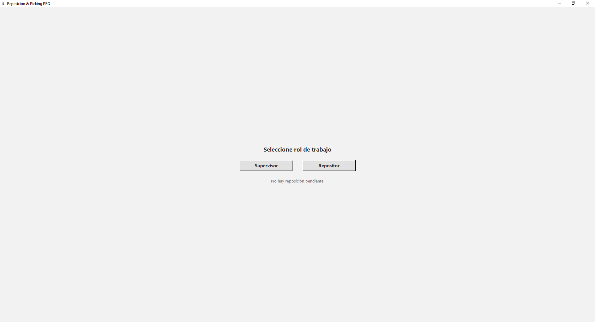
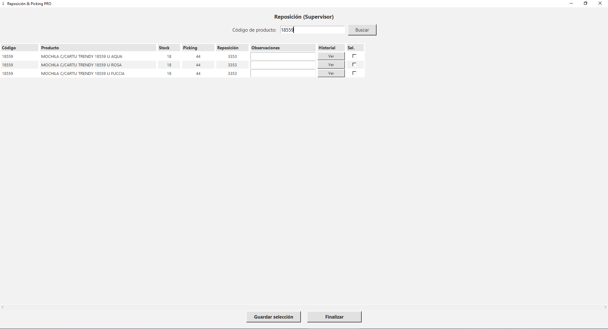
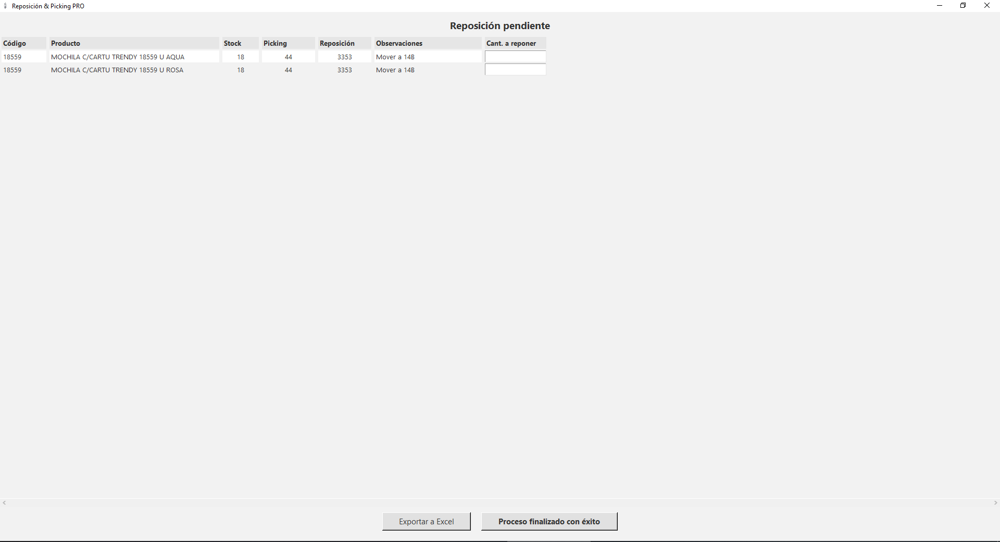

# Reposición & Picking PRO  
### WMS Ligero para PyMEs  
**Autor:** Eduardo Hernández

Sistema diseñado para depósitos de 300–5.000 SKU que trabajan con archivos CSV de stock, ventas y ubicaciones.  
Gestiona de forma clara y ordenada el flujo entre **Supervisor** (quien arma la reposición) y **Repositor** (quien la ejecuta y registra).

Su arquitectura ligera lo hace ideal para PyMEs que necesitan control operativo sin invertir en un WMS costoso.

---

## 🚀 Funcionalidades principales

### 🟩 Módulo Supervisor
- Búsqueda rápida por código (completo o parcial).  
- Visualización de:
  - Código  
  - Descripción  
  - Stock  
  - Ubicación de picking  
  - Cantidad propuesta de reposición  
- Carga de observaciones por producto.  
- Botón **“Ver historial”** para visualizar ventas (si existe ventas.csv).  
- Selección de productos a reponer.  
- Prevención automática de duplicados.  
- Generación del archivo **`reposicion_pendiente.json`**.  
- Estética profesional *Industrial Light v1.0* con filas intercaladas.  

---

### 🟦 Módulo Repositor
- Carga automática de la reposición pendiente.  
- Tabla centrada con estética profesional.  
- Filas intercaladas (#FFFFFF / #F2F2F2).  
- Campos para registrar cantidades repuestas.  
- Validación robusta (sin vacíos ni negativos).  
- Exportación a Excel para trabajar offline.  
- Registro automático en **`historico_reposiciones.csv`**.  
- Eliminación automática del archivo pendiente al finalizar.  

---

## 📁 Estructura del proyecto

```

reposicion_wms/
├── data/                     # Archivos CSV utilizados por el sistema
│   ├── stock.csv
│   ├── almacen.csv
│   ├── ventas.csv
│   └── historico_reposiciones.csv
│
├── logs/                     # Logging generado automáticamente
│   └── app.log
│
├── docs/
│   └── screenshots/          # Capturas usadas en el README
│       ├── pantalla_inicial.png
│       ├── supervisor.png
│       └── repositor.png
│
├── src/                      # Código fuente
│   ├── main.py
│   ├── core.py
│   ├── logger.py
│   ├── ui_role.py
│   ├── ui_supervisor.py
│   ├── ui_repositor.py
│   └── utils.py
│
├── README.md
└── CHANGELOG.md

```

## 📸 Capturas de pantalla

### 1. Pantalla inicial – Selección de rol


---

### 2. Interfaz del Supervisor – Resultados de búsqueda


---

### 3. Interfaz del Repositor – Reposición pendiente


---

## ⚙ Instalación y requisitos

### 🧩 Requisitos
- Windows 10/11  
- Python **3.10 o superior**  
- Biblioteca necesaria: **pandas**

### 🛠 Instalación de dependencias

En una terminal ejecutar:

```bash
pip install pandas

### ▶️ Cómo ejecutar el sistema

Ubicarse en la carpeta del proyecto y ejecutar:

```bash
python src/main.py
```
---

## 📝 Notas importantes

- El sistema funciona exclusivamente con archivos CSV provistos por la empresa.
- No requiere conexión a internet.
- No incluye integración con ERP en esta versión.
- No utiliza módulos de aprendizaje automático ni inteligencia artificial.
- Ideal como solución ligera de WMS para PyMEs o como proyecto de portfolio profesional.

---

## 👤 Autor

**Eduardo Hernández**  
Especialista en Automatización para PyMEs.  
Responsable del diseño funcional, lógica de negocio y desarrollo completo del sistema.

https://www.linkedin.com/in/hernandez-powerbi-business-intelligence/